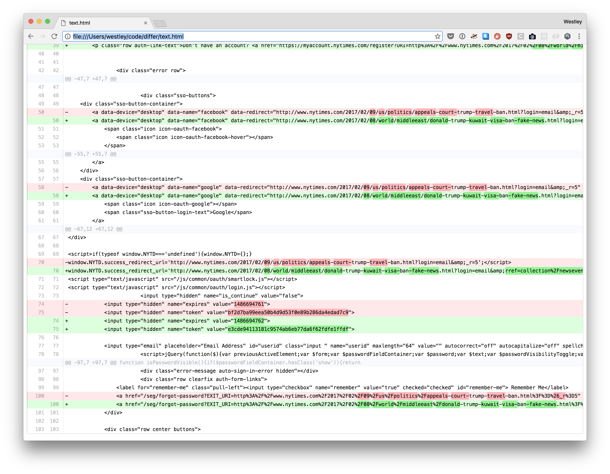

## Diffing service for the website monitoring project

Use this service to compare versions of web pages. It aims to replicate the Page Freezer compare service.

Read more about the website monitoring project here: https://github.com/edgi-govdata-archiving/web-monitoring

## Quick Start

1. `git clone git@github.com:edgi-govdata-archiving/web-monitoring-differ.git`
2. `npm install`
3. `npm run dev`

## Usage

`POST` to `localhost:8000/diff`

| Parameter	| Description |
|-----------|-------------|
| `source` (optional)|	Default: `auto`.  `auto`=url1 and url2 can be either URLs or text.  `url`=url1 and url2 must be URL of the target document.  `text`=url1 and url2 contain text to compare. |
| `url1` |	The source URL or text |
| `url2` |	The target URL or text |
| `html`  (optional) |	Default: `1`.  `2`=HTML with HEAD,  `1`=HTML without HEAD,  `0`=False (no HTML output). |
| `differ` (optional) | Default: `git`.   Currently only `git` diff is supported |

Currently unsupported:

| Parameter	| Description |
|-----------|-------------|
| `diffmode` (optional) | Default: `0`.  `0`=No pre-processing,  `1`=extra white spaces removed,  `2`=[\s]* are removed, `3`=HTML tags are removed for full-text comparison |
| `snippet`  (optional)	 | Default: `200` (characters). It will generate snippets of changes. |

## Output

The differ will return the content of the diff, either as a raw git diff string or a blob of html depending what you specified as the `html` parameter.

Example:

## Development

You can contribute new diffing strageties to `web-monitoring-differ` by adding them as modules (see [here](https://github.com/edgi-govdata-archiving/web-monitoring-differ/tree/master/src/GitDiff)) and then linking them in the api code [here](https://github.com/edgi-govdata-archiving/web-monitoring-differ/blob/master/src/Diff.js#L5-L9).

After that they'll be available via the `differ` parameter. Update the Usage docs above, and submit a pull request!
